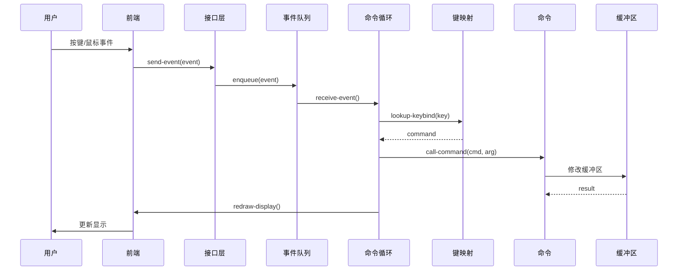

# Lem 编辑器架构文档

> 本文档提供 Lem 编辑器的完整架构分析，适用于开发者和贡献者。

## 目录

1. [概述](#1-概述)
2. [系统架构](#2-系统架构)
3. [执行流程](#3-执行流程)
4. [核心模块](#4-核心模块)
5. [前端系统](#5-前端系统)
6. [扩展系统](#6-扩展系统)
7. [数据模型](#7-数据模型)
8. [配置系统](#8-配置系统)
9. [构建与发布](#9-构建与发布)
10. [可观测性](#10-可观测性)
11. [风险与改进](#11-风险与改进)

---

## 1. 概述

### 1.1 项目愿景

Lem 是一个用 Common Lisp 编写的文本编辑器，旨在将代码与其执行状态之间的距离缩短到零。用户可以在编辑时看到程序的结果，并实时可视化地跟踪运行代码的行为。

### 1.2 核心用例

| 用例 | 描述 |
|------|------|
| 交互式 Lisp 开发 | REPL 集成、实时代码评估 |
| 通用文本编辑 | 支持 50+ 种语言的语法高亮 |
| LSP 支持 | 通过 Language Server Protocol 支持多语言 |
| Vi 模式 | 为 Vim 用户提供键位模拟 |

### 1.3 非目标

- 不模仿 Emacs 或 Vim，Lem 追求自己独特的方法
- 不替代 IDE，专注于文本编辑和代码理解

---

## 2. 系统架构

### 2.1 四层架构

```
┌─────────────────────────────────────────────────────────────┐
│                    Frontends（前端层）                        │
│  ┌─────────┐ ┌─────────┐ ┌─────────┐ ┌─────────┐           │
│  │  SDL2   │ │ NCurses │ │ Webview │ │ Server  │           │
│  │  图形界面 │ │  终端   │ │  浏览器  │ │ JSON-RPC│           │
│  └────┬────┘ └────┬────┘ └────┬────┘ └────┬────┘           │
└───────┼──────────┼──────────┼──────────┼───────────────────┘
        │          │          │          │
        └──────────┴──────────┴──────────┘
                          │
                          ▼ lem-if:* 泛型函数
┌─────────────────────────────────────────────────────────────┐
│                 Interface Layer（接口层）                     │
│  ┌──────────────────────────────────────────────────────┐  │
│  │  implementation 类 + ~50 个 lem-if:* 泛型函数          │  │
│  │  display-*, view-*, render-*, clipboard-*, font-*    │  │
│  └──────────────────────────────────────────────────────┘  │
└────────────────────────────┬────────────────────────────────┘
                             │
                             ▼
┌─────────────────────────────────────────────────────────────┐
│                    Core（核心层）                             │
│  ┌──────────┐ ┌──────────┐ ┌──────────┐ ┌──────────┐       │
│  │  Buffer  │ │  Window  │ │   Mode   │ │ Command  │       │
│  │  缓冲区   │ │  窗口    │ │   模式   │ │   命令   │       │
│  └──────────┘ └──────────┘ └──────────┘ └──────────┘       │
│  ┌──────────┐ ┌──────────┐ ┌──────────┐ ┌──────────┐       │
│  │  Keymap  │ │  EventQ  │ │  Syntax  │ │  Editor  │       │
│  │  键映射   │ │ 事件队列  │ │  语法    │ │  编辑器  │       │
│  └──────────┘ └──────────┘ └──────────┘ └──────────┘       │
└────────────────────────────┬────────────────────────────────┘
                             │
                             ▼
┌─────────────────────────────────────────────────────────────┐
│                  Extensions（扩展层）                         │
│  ┌──────────┐ ┌──────────┐ ┌──────────┐ ┌──────────┐       │
│  │Lisp Mode │ │ LSP Mode │ │  Vi Mode │ │Lang Modes│       │
│  │ Lisp模式 │ │ LSP模式  │ │  Vi模式  │ │ 语言模式 │       │
│  └──────────┘ └──────────┘ └──────────┘ └──────────┘       │
│  ┌──────────┐ ┌──────────┐ ┌──────────┐ ┌──────────┐       │
│  │ Terminal │ │  Legit   │ │ Copilot  │ │LivingCanvas│     │
│  │   终端   │ │ Git集成  │ │ AI助手   │ │  活画布   │       │
│  └──────────┘ └──────────┘ └──────────┘ └──────────┘       │
└─────────────────────────────────────────────────────────────┘
```

### 2.2 层级职责

| 层级 | 描述 | 位置 |
|------|------|------|
| **Frontends** | 平台特定的 UI 实现 | `frontends/` |
| **Interface** | 前端抽象层，定义 `lem-if:*` 协议 | `src/interface.lisp` |
| **Core** | 编辑器内核，缓冲区/窗口/键映射管理 | `src/` |
| **Extensions** | 语言模式、LSP、Vi 模式等 | `extensions/` |

---

## 3. 执行流程

### 3.1 启动序列

```
用户启动 → lem:main → parse-args → launch
                                    │
                                    ▼
                          get-default-implementation
                                    │
                                    ▼
                          invoke-frontend
                                    │
                                    ▼
                          run-editor-thread
                                    │
                ┌───────────────────┴───────────────────┐
                │                                       │
                ▼                                       ▼
           setup()                            toplevel-command-loop
                │                                       │
                ▼                                       ▼
      setup-first-frame                          init(args)
      init-syntax-scanner                   load-init-file
                │                                       │
                └───────────────────┬───────────────────┘
                                    │
                                    ▼
                              编辑器运行中
```

### 3.2 事件处理流程



### 3.3 关键入口点

| 函数 | 文件 | 描述 |
|------|------|------|
| `lem:main` | `src/lem.lisp:143` | 命令行入口点 |
| `lem:lem` | `src/lem.lisp:140` | 编程入口点 |
| `launch` | `src/lem.lisp:99` | 初始化并启动前端 |
| `run-editor-thread` | `src/lem.lisp:75` | 在独立线程中运行编辑器 |
| `setup` | `src/lem.lisp:22` | 初始化首帧和语法扫描器 |
| `init` | `src/lem.lisp:68` | 加载用户配置 |

---

## 4. 核心模块

### 4.1 模块概览

| 模块 | 用途 | 关键文件 |
|------|------|----------|
| `lem/core` | 主编辑器系统 | `src/lem.lisp`, `src/interp.lisp` |
| `buffer` | 文本缓冲区管理 | `src/buffer/internal/buffer.lisp` |
| `window` | 窗口树和显示 | `src/window/` |
| `keymap` | 键绑定系统 | `src/keymap.lisp` |
| `mode` | 主/次模式系统 | `src/mode.lisp` |
| `command` | 命令定义和执行 | `src/defcommand.lisp`, `src/command.lisp` |
| `interface` | 前端抽象层 | `src/interface.lisp` |
| `event-queue` | 异步事件处理 | `src/event-queue.lisp` |

### 4.2 Buffer 系统

Buffer 是 Lem 的核心数据结构，存储文本内容和编辑状态。

```
Buffer（缓冲区）
├── name: string                    ; 缓冲区名称
├── filename: pathname (optional)   ; 关联文件
├── directory: pathname             ; 工作目录
├── point: Point                    ; 光标位置
├── start-point / end-point: Point  ; 缓冲区边界
├── mark: Mark                      ; 标记（区域选择）
├── major-mode: symbol              ; 主模式
├── minor-modes: list               ; 次模式列表
├── syntax-table: SyntaxTable       ; 语法表
├── variables: hash-table           ; 缓冲区局部变量
├── modified-p: boolean             ; 修改标志
├── read-only-p: boolean            ; 只读标志
├── encoding: encoding              ; 编码
├── edit-history: array             ; 撤销历史
└── redo-stack: array               ; 重做栈
```

**Point（点）** 表示缓冲区中的位置：

```
Point（点）
├── buffer: Buffer       ; 所属缓冲区
├── line: Line           ; 行对象
├── charpos: integer     ; 字符偏移
└── kind: keyword        ; :temporary, :left-inserting, :right-inserting
```

**关键操作**：
- `make-buffer`, `get-buffer`, `delete-buffer`, `bury-buffer`
- `buffer-modified-p`, `buffer-value` (缓冲区局部变量)
- `current-point`, `copy-point`, `move-point`, `line-offset`

### 4.3 Window 系统

Window 负责显示 Buffer 内容，支持分割和浮动窗口。

```
Window（窗口）
├── buffer: Buffer          ; 显示的缓冲区
├── view-point: Point       ; 视口滚动位置
├── point: Point            ; 光标位置
├── x, y: integer           ; 几何位置
├── width, height: integer  ; 几何尺寸
├── modeline-format         ; 模式行格式
└── use-modeline-p: boolean ; 是否显示模式行
```

**窗口树结构**：窗口以树形组织，支持水平和垂直分割。

```
window-node
├── :hsplit [left-node right-node]
└── :vsplit [top-node bottom-node]
```

**窗口类型**：
| 类型 | 文件 | 描述 |
|------|------|------|
| Regular | `window.lisp` | 树结构中的常规窗口 |
| Floating | `floating-window.lisp` | 浮动窗口（弹出框等） |
| Attached | `attached-window.lisp` | 附加窗口 |
| Side | `side-window.lisp` | 侧边窗口 |

**关键操作**：
- `split-window-vertically`, `split-window-horizontally`, `delete-window`
- `window-see` (滚动到显示点), `window-recenter`
- `switch-to-buffer`, `pop-to-buffer`, `other-buffer`

### 4.4 Mode 系统

Mode 系统支持主模式（每个缓冲区一个）和次模式（可多个）。

**模式类层次**：

```
mode
├── major-mode          ; 主模式（每缓冲区一个）
│   └── language-mode   ; 语言模式基类
│       └── lisp-mode, python-mode, js-mode, ...
├── minor-mode          ; 次模式（可多个）
│   └── lsp-mode        ; LSP 集成
└── global-minor-mode   ; 全局次模式（所有缓冲区）
```

**定义模式**：

```lisp
;; 主模式
(define-major-mode my-mode language-mode
    (:name "MyLang"
     :keymap *my-mode-keymap*
     :syntax-table *my-syntax-table*
     :mode-hook *my-mode-hook*)
  ;; 模式体
  (setf (variable-value 'enable-syntax-highlight) t
        (variable-value 'tab-width) 2))

;; 次模式
(define-minor-mode my-minor-mode
    (:name "MyMinor"
     :keymap *my-minor-mode-keymap*
     :global nil
     :enable-hook 'on-enable
     :disable-hook 'on-disable))
```

### 4.5 Command 系统

命令是用户可交互调用的操作。

**定义命令**：

```lisp
(define-command command-name (params) (arg-descriptors)
  "文档字符串"
  body)
```

**参数描述符**：

| 描述符 | 别名 | 描述 |
|--------|------|------|
| `:universal` | `p` | 前缀参数（默认 1） |
| `:universal-nil` | `P` | 前缀参数（默认 nil） |
| `:string` | `s` | 提示输入字符串 |
| `:number` | `n` | 提示输入数字 |
| `:buffer` | `b` | 提示选择缓冲区 |
| `:file` | `f` | 提示选择现有文件 |
| `:new-file` | `F` | 提示输入新文件路径 |
| `:region` | `r` | 传递区域起点和终点 |

**示例**：

```lisp
;; 无参数命令
(define-command my-hello () ()
  "显示问候语。"
  (message "Hello!"))

;; 带前缀参数
(define-command forward-n-lines (&optional (n 1)) (:universal)
  "向前移动 N 行。"
  (next-line n))

;; 带区域操作
(define-command upcase-region (start end) (:region)
  "将区域转换为大写。"
  (uppercase-region start end))
```

### 4.6 Keymap 系统

键映射将按键序列绑定到命令。

```lisp
;; 单个绑定
(define-key *my-mode-keymap* "C-c C-c" 'my-command)

;; 多个绑定
(define-keys *my-mode-keymap*
  ("C-c C-c" 'compile)
  ("C-c C-r" 'run)
  ("M-." 'find-definition))
```

**按键表示法**：
- `C-` = Control
- `M-` = Meta (Alt)
- `S-` = Shift
- `Super-` = Super (Windows/Command 键)

---

## 5. 前端系统

### 5.1 前端概览

Lem 支持多种前端，通过 `lem-if:*` 泛型函数接口统一。

| 前端 | 包名 | 传输方式 | 文件位置 |
|------|------|----------|----------|
| SDL2 | `lem-sdl2` | 原生图形 | `frontends/sdl2/` |
| NCurses | `lem-ncurses` | 终端 | `frontends/ncurses/` |
| Webview | `lem-webview` | WebKit/Chromium | `frontends/webview/` |
| Server | `lem-server` | JSON-RPC over WebSocket | `frontends/server/` |
| PDCurses | `lem-pdcurses` | Windows 终端 | `frontends/pdcurses/` |
| Fake | `lem-fake-interface` | 测试用 | `frontends/fake-interface/` |

### 5.2 Interface 层 API

`src/interface.lisp` 定义了 `implementation` 类和约 50 个泛型函数：

**显示相关**：
- `display-width`, `display-height` — 显示尺寸
- `display-title`, `set-display-title` — 窗口标题
- `display-fullscreen-p`, `set-display-fullscreen-p` — 全屏
- `maximize-frame`, `minimize-frame` — 最大化/最小化

**视图管理**：
- `make-view`, `delete-view` — 创建/删除视图
- `set-view-size`, `set-view-pos` — 设置视图大小/位置
- `view-width`, `view-height` — 视图尺寸
- `make-view-with-pixels` — 像素级定位（可选）

**渲染**：
- `render-line` — 渲染文本行
- `render-line-on-modeline` — 渲染模式行
- `clear-to-end-of-window` — 清除到窗口末尾
- `update-display` — 更新显示

**剪贴板**：
- `clipboard-paste`, `clipboard-copy` — 粘贴/复制

**字体**：
- `get-font-list`, `get-font` — 获取字体列表
- `set-font-name`, `set-font-size` — 设置字体
- `increase-font-size`, `decrease-font-size` — 调整字体大小

**入口点**：
- `lem-if:invoke` — 启动前端

### 5.3 前端实现模式

#### SDL2 前端

```
frontends/sdl2/
├── main.lisp      — 入口点，实现 lem-if:* 方法
├── display.lisp   — 显示管理，SDL2 渲染器
├── view.lisp      — 视图/窗口渲染
├── keyboard.lisp  — 按键处理
├── mouse.lisp     — 鼠标输入
└── font.lisp      — 字体管理（TTF 支持）
```

**特点**：
- 硬件加速渲染
- 支持 HiDPI、自定义字体、Emoji
- 支持字符和像素级定位

#### NCurses 前端

```
frontends/ncurses/
├── ncurses.lisp   — 入口点
├── mainloop.lisp  — 输入循环，事件处理
├── term.lisp      — 终端初始化
├── view.lisp      — 视图渲染
├── render.lisp    — 行渲染
├── input.lisp     — 输入处理
└── clipboard.lisp — 剪贴板（通过外部命令）
```

**特点**：
- 双线程架构：编辑器线程 + 输入线程
- 终端能力检测（颜色、鼠标等）
- 通过 `lem:send-event` 通信

#### Server/JSON-RPC 前端

```
frontends/server/
├── main.lisp  — 主实现（~850 行）
├── view.lisp  — 视图抽象
└── mouse.lisp — 鼠标处理
```

**特点**：
- JSON-RPC 协议（WebSocket/stdio/本地套接字）
- 前端（浏览器）通过 JSON-RPC 发送事件
- 编辑器通过 `notify*` 发送渲染更新

### 5.4 前端启动流程

```
lem:lem (入口点)
  ↓
invoke-frontend (src/interface.lisp)
  ↓
lem-if:invoke (前端特定实现)
  ↓
[前端启动]
  ├── SDL2: 创建窗口，启动事件循环
  ├── ncurses: 启动输入线程 + 编辑器线程
  ├── Server: 启动 JSON-RPC 服务器
  └── WebView: 启动服务器 + webview 窗口
  ↓
编辑器核心运行，调用 lem-if:* 进行显示
  ↓
前端根据 lem-if:* 调用进行渲染
```

### 5.5 添加新前端

1. 创建继承 `lem:implementation` 的实现类
2. 实现关键 `lem-if:*` 方法（从以下开始：`invoke`, `display-width`, `display-height`, `make-view`, `update-display`, `render-line`）
3. 实现输入处理，调用 `lem:send-event`
4. 添加到 `get-default-implementation` 的回退列表（`interface.lisp:62`）

---

## 6. 扩展系统

### 6.1 扩展目录结构

```
extensions/
├── my-mode/
│   ├── lem-my-mode.asd    # ASDF 系统定义
│   ├── package.lisp       # 包定义（可选）
│   ├── my-mode.lisp       # 模式定义
│   ├── syntax-parser.lisp # 语法高亮（可选）
│   ├── commands.lisp      # 命令定义（可选）
│   └── lsp-config.lisp    # LSP 集成（可选）
```

### 6.2 模式继承层次

```
fundamental-mode (内置基类)
    │
    └── language-mode (src/ext/language-mode.lisp)
            │
            ├── json-mode
            ├── yaml-mode
            ├── lisp-mode
            ├── python-mode
            ├── js-mode
            └── ... (50+ 语言模式)
```

**language-mode 提供的功能**：
- 缩进函数（`indent`, `newline-and-indent`, `indent-region`）
- 注释支持（`comment-region`, `uncomment-region`）
- XRef 导航（`find-definitions`, `find-references`）
- 符号补全（`complete-symbol`）
- 键绑定（C-M-a, C-M-e, M-., M-_, M-;, Tab 等）

### 6.3 创建语言模式

**最小示例**：

```lisp
;; package.lisp
(defpackage :lem-my-mode
  (:use :cl :lem :lem/language-mode)
  (:export :*my-mode-hook*
           :my-mode))
(in-package :lem-my-mode)

;; my-mode.lisp
;; 1. 定义语法表
(defvar *my-syntax-table*
  (let ((table (make-syntax-table
                :space-chars '(#\space #\tab #\newline)
                :symbol-chars '(#\_ #\-)
                :paren-pairs '((#\( . #\)) (#\{ . #\}) (#\[ . #\]))
                :string-quote-chars '(#\" #\')
                :line-comment-string "#")))
    (set-syntax-parser table (make-tmlanguage-my))
    table))

;; 2. 定义模式
(define-major-mode my-mode language-mode
    (:name "MyLang"
     :keymap *my-mode-keymap*
     :syntax-table *my-syntax-table*
     :mode-hook *my-mode-hook*)
  ;; 3. 设置缓冲区变量
  (setf (variable-value 'enable-syntax-highlight) t
        (variable-value 'indent-tabs-mode) nil
        (variable-value 'tab-width) 2
        (variable-value 'line-comment) "#"))

;; 4. 注册文件类型
(define-file-type ("my" "myl") my-mode)
```

### 6.4 语法高亮

使用 TextMate 风格的模式：

```lisp
(defun make-tmlanguage-my ()
  (make-tmlanguage
   :patterns
   (make-tm-patterns
    ;; 行注释
    (make-tm-region "#" "$" :name 'syntax-comment-attribute)
    ;; 块注释
    (make-tm-region "/\\*" "\\*/" :name 'syntax-comment-attribute)
    ;; 关键字
    (make-tm-match "\\b(if|else|while|for|return)\\b"
                   :name 'syntax-keyword-attribute)
    ;; 字符串
    (make-tm-string-region "\""))))
```

**可用属性**：
- `syntax-comment-attribute`
- `syntax-keyword-attribute`
- `syntax-string-attribute`
- `syntax-builtin-attribute`
- `syntax-constant-attribute`
- `syntax-function-name-attribute`
- `syntax-variable-attribute`
- `syntax-type-attribute`

### 6.5 LSP 集成

创建 `lsp-config.lisp`：

```lisp
(defpackage :lem-my-mode/lsp-config
  (:use :cl :lem-lsp-mode :lem-lsp-base/type))
(in-package :lem-my-mode/lsp-config)

(define-language-spec (my-spec lem-my-mode:my-mode)
  :language-id "mylang"                    ; LSP 语言标识符
  :root-uri-patterns '("my.config")        ; 项目根标记文件
  :command '("my-language-server" "--stdio") ; 启动命令
  :install-command "npm install -g my-language-server"
  :connection-mode :stdio)                  ; 或 :tcp
```

**LSP 提供的功能**：
- 代码补全（`text-document/completion`）
- 跳转定义（`text-document/definition`）
- 查找引用（`text-document/references`）
- 悬停信息（`text-document/hover`）
- 签名帮助（`text-document/signature-help`）
- 诊断信息（错误高亮）

### 6.6 关键缓冲区变量

| 变量 | 用途 |
|------|------|
| `indent-tabs-mode` | 是否使用 Tab 缩进 |
| `tab-width` | Tab 宽度 |
| `calc-indent-function` | 自定义缩进函数 |
| `line-comment` | 行注释前缀 |
| `enable-syntax-highlight` | 启用语法高亮 |
| `find-definitions-function` | 查找定义函数 |
| `find-references-function` | 查找引用函数 |
| `completion-spec` | 补全规范 |

### 6.7 注册扩展

在 `lem.asd` 的 `lem/extensions` 系统中添加：

```lisp
(defsystem "lem/extensions"
  :depends-on (
               ;; ... 现有扩展
               "lem-my-mode"))
```

---

## 7. 数据模型

### 7.1 核心数据结构

```
┌─────────────────────────────────────────────────────────────┐
│                         Frame                               │
│  ┌─────────────────────────────────────────────────────┐   │
│  │                     Window Tree                      │   │
│  │  ┌──────────────┬──────────────────────────────┐    │   │
│  │  │   Window 1   │         Window 2             │    │   │
│  │  │  ┌────────┐  │  ┌────────────────────────┐  │    │   │
│  │  │  │ Buffer │  │  │        Buffer          │  │    │   │
│  │  │  │  Point │  │  │  Point    Mark         │  │    │   │
│  │  │  │  Text  │  │  │  Text                  │  │    │   │
│  │  │  └────────┘  │  └────────────────────────┘  │    │   │
│  │  └──────────────┴──────────────────────────────┘    │   │
│  └─────────────────────────────────────────────────────┘   │
└─────────────────────────────────────────────────────────────┘
```

### 7.2 关系图

```
Frame 1 ─────┬── Window 1 ─── Buffer A ─── Point, Mark
             │
             ├── Window 2 ─── Buffer A ─── Point
             │                  ↑
             │                  └── 多窗口共享同一缓冲区
             │
             └── Window 3 ─── Buffer B ─── Point, Mark

Buffer A ─── Major Mode ─── Keymap
          ─── Minor Modes ─── Keymaps
          ─── Syntax Table
          ─── Variables (buffer-local)
```

---

## 8. 配置系统

### 8.1 配置位置

按优先级排序：

1. `$LEM_HOME/init.lisp`
2. `~/.config/lem/init.lisp` (XDG)
3. `~/.lem/init.lisp`
4. `~/.lemrc`

### 8.2 环境变量

| 变量 | 用途 |
|------|------|
| `LEM_HOME` | 覆盖默认配置目录 |

### 8.3 配置示例

```lisp
;; ~/.lem/init.lisp

;; 设置主题
(load-theme "monokai")

;; 设置字体
(set-font :name "JetBrains Mono" :size 14)

;; 启用全局次模式
(enable-minor-mode vi-mode)

;; 自定义键绑定
(define-key *global-keymap* "C-x C-j" 'dired-jump)

;; 钩子
(add-hook *find-file-hook* 'my-on-file-open)
```

---

## 9. 构建与发布

### 9.1 构建系统

- **ASDF** — 系统定义和编译
- **Qlot** — 依赖管理

### 9.2 构建命令

```bash
# 安装依赖
qlot install

# 运行测试
make test

# 构建 SDL2 版本
make sdl2

# 构建 ncurses 版本
make ncurses
```

### 9.3 CI/CD 流程

`.github/workflows/test.yml`：

1. 安装系统依赖（gtk, webkit）
2. 安装 Roswell（Common Lisp 安装器）
3. 通过 Qlot 安装依赖
4. 运行 lint（检查内部符号使用）
5. 通过 Rove 运行测试
6. 构建并推送 Docker 镜像（main 分支）

### 9.4 构建目标

| 目标 | 描述 |
|------|------|
| Terminal (ncurses) | 终端版本 |
| SDL2 (graphical) | 图形界面版本 |
| Webview (embedded browser) | 嵌入式浏览器版本 |

---

## 10. 可观测性

### 10.1 日志

- **框架**：log4cl
- **默认日志文件**：`~/.lem/debug.log`
- **配置**：通过 `--log` 命令行参数

### 10.2 日志级别

```lisp
(log:info "Starting Lem")
(log:debug "Processing event: ~A" event)
(log:error "Failed to load file: ~A" path)
```

---

## 11. 风险与改进

### 11.1 已识别风险

| 风险 | 严重性 | 描述 | 缓解措施 |
|------|--------|------|----------|
| 线程安全 | 中 | 事件队列和缓冲区修改可能存在竞态条件 | `make-concurrent-queue` |
| 内存管理 | 中 | 大文件编辑可能积累过多撤销历史 | 可调整数组 |
| 前端耦合 | 低 | 接口抽象要求前端实现许多方法 | ~40+ 泛型函数 |
| LSP 错误处理 | 低 | 与语言服务器的网络故障可能处理不当 | 基本错误处理 |

### 11.2 改进建议

1. **文档** — 为公共 API 和复杂算法添加内联文档
2. **测试覆盖** — 扩展 vi-mode 之外的自动化测试
3. **插件系统** — 通过版本控制形式化扩展 API
4. **性能** — 对大文件的语法高亮进行性能分析和优化

### 11.3 开放问题

1. 删除缓冲区时如何处理缓冲区垃圾回收？
2. LSP 异步请求与编辑器线程交互的线程模型是什么？
3. 如何防止扩展之间的循环依赖？

---

## 12. 外部依赖

### 12.1 核心依赖

| 依赖 | 用途 |
|------|------|
| `bordeaux-threads` | 线程原语 |
| `cl-ppcre` | 正则表达式 |
| `alexandria` | Common Lisp 工具 |
| `trivia` | 模式匹配 |
| `yason` | JSON 解析 |
| `log4cl` | 日志 |
| `dexador` | HTTP 客户端 |
| `micros` | SLIME/Swank 集成 |

### 12.2 前端特定依赖

| 前端 | 依赖 |
|------|------|
| SDL2 | `sdl2`, `sdl2-ttf`, `sdl2-image` |
| NCurses | `cl-charms` |
| Webview | 平台特定 webview 库 |

---

## 附录 A：关键文件索引

| 文件 | 行数 | 描述 |
|------|------|------|
| `src/lem.lisp` | 1-168 | 主入口点，初始化 |
| `src/interface.lisp` | 1-284 | 前端抽象层 |
| `src/interp.lisp` | 1-177 | 命令循环，错误处理 |
| `src/event-queue.lisp` | 1-33 | 事件队列实现 |
| `src/keymap.lisp` | 1-238 | 键绑定系统 |
| `src/mode.lisp` | 1-336 | 模式系统（主/次） |
| `src/input.lisp` | 1-114 | 输入处理 |
| `src/config.lisp` | 1-41 | 配置系统 |
| `src/buffer/internal/buffer.lisp` | 1-411 | 缓冲区实现 |
| `src/ext/language-mode.lisp` | - | 语言模式基类 |
| `frontends/sdl2/main.lisp` | 1-502 | SDL2 前端 |
| `frontends/webview/main.lisp` | 1-52 | Webview 前端 |
| `extensions/lsp-mode/lsp-mode.lisp` | 1-1926 | LSP 集成 |
| `lem.asd` | 1-317 | 系统定义 |

---

## 附录 B：新功能 Living Canvas

Living Canvas 是 Lem 的一个新扩展，提供代码可视化功能。

### 架构

```
┌─────────────────────────────────────────────────────────────┐
│                    Living Canvas                            │
│  ┌─────────────────────────────────────────────────────┐   │
│  │     WebView Frontend (HTML/CSS/JS)                  │   │
│  │     - Cytoscape.js for graph rendering              │   │
│  │     - 节点绘制、拖放                                  │   │
│  │     - 执行状态实时可视化                              │   │
│  └─────────────────────────────────────────────────────┘   │
│                         ↕ JSON-RPC                          │
│  ┌─────────────────────────────────────────────────────┐   │
│  │         Lem Core (Common Lisp)                      │   │
│  │     - 缓冲区/窗口管理                                 │   │
│  │     - Lisp 评估引擎                                  │   │
│  │     - 调用图分析                                     │   │
│  │     - AI API 集成                                   │   │
│  └─────────────────────────────────────────────────────┘   │
└─────────────────────────────────────────────────────────────┘
```

### 文件结构

```
extensions/living-canvas/
├── lem-living-canvas.asd   # 系统定义
├── package.lisp            # 包定义
├── call-graph.lisp         # 函数调用图分析
├── canvas-buffer.lisp      # Canvas 缓冲区类
├── commands.lisp           # 用户命令
├── trace.lisp              # 执行跟踪 (Phase 2)
└── debugger.lisp           # SLDB 集成 (Phase 2.5)
```

### 开发阶段

| 阶段 | 功能 | 状态 |
|------|------|------|
| Phase 1 | 基础图形可视化 | ✅ 完成 |
| Phase 1.5 | 交互式探索增强 | 🚧 进行中 |
| Phase 1.7 | 代码联动增强 | ⬚ 待开始 |
| Phase 2 | 执行可视化 | ⬚ 待开始 |
| Phase 3 | AI 集成 | ⬚ 待开始 |

---

*文档生成日期：2026-03-23*
*基于 Lem 版本：2.3.0*
